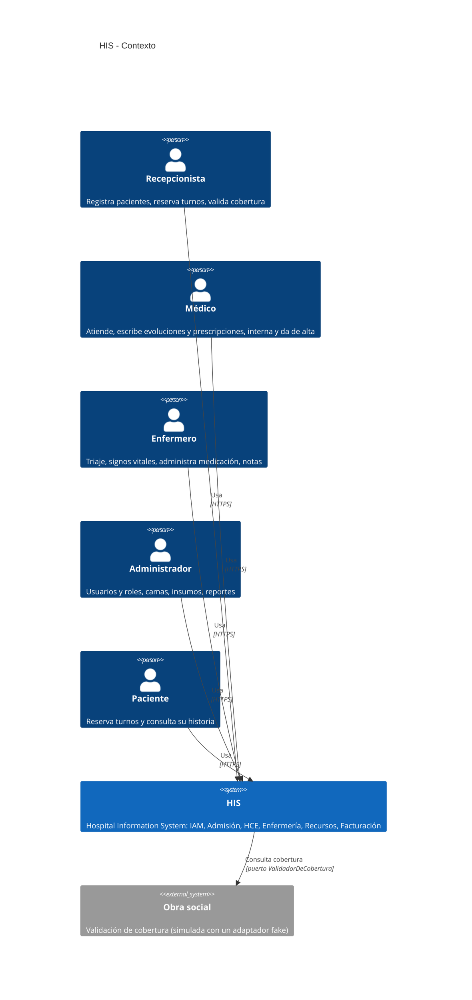
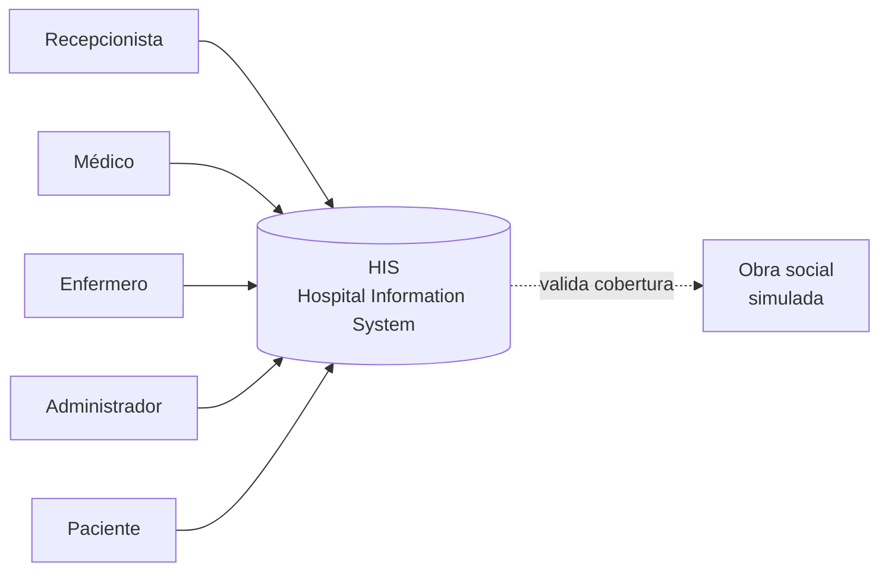

# C4 — Nivel 1: Contexto del sistema

Qué es el HIS, quién lo usa y con qué sistemas externos habla.

```mermaid
C4Context
    title HIS - Contexto

    Person(recep, "Recepcionista", "Registra pacientes, reserva turnos, valida cobertura")
    Person(medico, "Médico", "Atiende, escribe evoluciones y prescripciones, interna y da de alta")
    Person(enf, "Enfermero", "Triaje, signos vitales, administra medicación, notas")
    Person(admin, "Administrador", "Usuarios y roles, camas, insumos, reportes")
    Person(pac, "Paciente", "Reserva turnos y consulta su historia")

    System(his, "HIS", "Hospital Information System: IAM, Admisión, HCE, Enfermería, Recursos, Facturación")

    System_Ext(os, "Obra social", "Validación de cobertura (simulada con un adaptador fake)")

    Rel(recep, his, "Usa", "HTTPS")
    Rel(medico, his, "Usa", "HTTPS")
    Rel(enf, his, "Usa", "HTTPS")
    Rel(admin, his, "Usa", "HTTPS")
    Rel(pac, his, "Usa", "HTTPS")
    Rel(his, os, "Consulta cobertura", "puerto ValidadorDeCobertura")
```

Si el bloque `C4Context` no se renderiza en tu visor, la versión equivalente en `flowchart`:

```mermaid
flowchart LR
    R[Recepcionista] --> HIS
    M[Médico] --> HIS
    E[Enfermero] --> HIS
    A[Administrador] --> HIS
    P[Paciente] --> HIS
    HIS[(HIS<br/>Hospital Information System)]
    HIS -. valida cobertura .-> OS[Obra social<br/>simulada]
```
